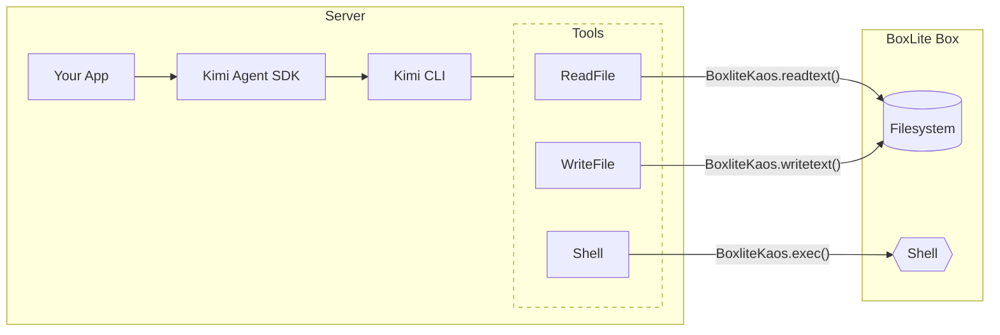

# Example: BoxLite Sandbox

This example demonstrates how to run Kimi Agent in a BoxLite sandbox using **KAOS** (Kimi Agent Operating System).

## What is KAOS?

**KAOS** is a runtime abstraction layer that decouples agent tools from the underlying execution environment. It defines a standard interface for file system operations, process execution, and path manipulation—allowing the same agent code to run locally or in a sandbox.



By default, tools operate on your local filesystem. With `set_current_kaos(BoxliteKaos(...))`, all tool calls are transparently routed to the BoxLite box—no agent code changes required.

## How It Works

This example vendors a `BoxliteKaos` implementation in `boxlite_kaos.py`, then installs it via `set_current_kaos` so Kimi CLI tools operate inside the BoxLite sandbox:

```python
import boxlite
from kaos import set_current_kaos
from kaos.path import KaosPath
from kimi_agent_sdk import prompt

runtime = boxlite.Boxlite.default()
box = await runtime.create(boxlite.BoxOptions(image="python:3.12-slim"))
await box.start()

set_current_kaos(BoxliteKaos(box, cwd="/root/kimi-workdir"))
async for msg in prompt("Explore the sandbox", work_dir=KaosPath("/root/kimi-workdir")):
    print(msg.extract_text(), end="")
```

## Run

```sh
cd examples/python/boxlite-sandbox
uv sync --reinstall

# Required
export KIMI_API_KEY=your-api-key
export KIMI_BASE_URL=https://api.moonshot.ai/v1
export KIMI_MODEL_NAME=kimi-k2-thinking-turbo

# Optional
export BOXLITE_IMAGE=python:3.12-slim
export KIMI_WORK_DIR=/root/kimi-workdir

uv run main.py
```

The example creates a BoxLite box, runs the agent inside it, and stops the box on exit. The agent config in `agent.yaml` disables `Grep` because it only supports local KAOS.
