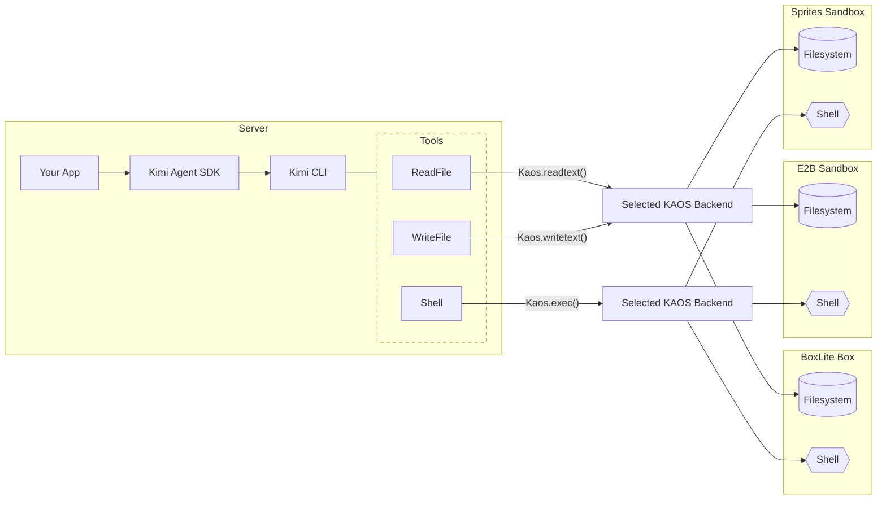

# Python KAOS Sandboxes

This directory groups all Python KAOS sandbox backends under one place:

- `boxlite/`: local BoxLite runtime backend
- `e2b/`: E2B cloud sandbox backend
- `sprites/`: Sprites cloud sandbox backend

All three use the same pattern:

1. Create or connect to a sandbox resource
2. Install backend via `set_current_kaos(...)`
3. Call `prompt(...)` or `Session` normally
4. Reset KAOS context and optionally clean up resources

## Backends

- `examples/python/kaos/boxlite`: local BoxLite runtime backend
- `examples/python/kaos/e2b`: E2B cloud sandbox backend
- `examples/python/kaos/sprites`: Sprites cloud sandbox backend
