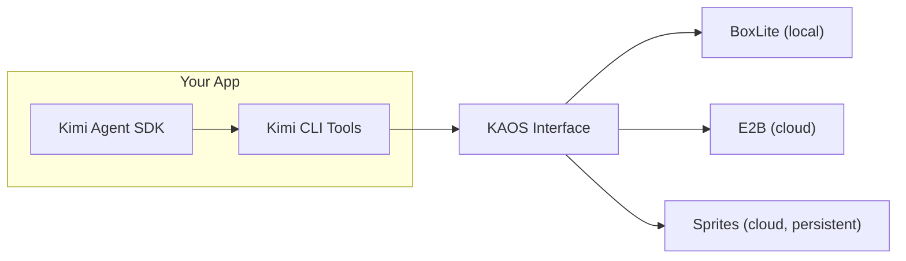

# Python KAOS Sandboxes

This directory groups all Python KAOS sandbox backends under one place:

- `boxlite/`: local BoxLite runtime backend
- `e2b/`: E2B cloud sandbox backend
- `sprites/`: Sprites cloud sandbox backend

All three use the same pattern:

1. Create or connect to a sandbox resource
2. Install backend via `set_current_kaos(...)`
3. Call `prompt(...)` or `Session` normally
4. Reset KAOS context and optionally clean up resources



## Common Setup

```sh
# Common required env vars
export KIMI_API_KEY=your-api-key
export KIMI_BASE_URL=https://api.moonshot.ai/v1
export KIMI_MODEL_NAME=kimi-k2-thinking-turbo
```

## BoxLite

Path: `examples/python/kaos/boxlite`

```sh
cd examples/python/kaos/boxlite
uv sync --reinstall

# Optional
export BOXLITE_IMAGE=python:3.12-slim
export KIMI_WORK_DIR=/root/kimi-workdir

uv run main.py
```

Notes:
- Runs locally via BoxLite.
- Script creates a box, runs the task, then stops the box.

## E2B

Path: `examples/python/kaos/e2b`

```sh
cd examples/python/kaos/e2b
uv sync --reinstall

# Required
export E2B_API_KEY=your-e2b-api-key

# Optional
export E2B_SANDBOX_ID=...
export KIMI_WORK_DIR=/home/user/kimi-workdir

uv run main.py
```

Notes:
- If `E2B_SANDBOX_ID` is unset, a new sandbox is created.
- Sandbox lifecycle is managed outside the SDK.

## Sprites

Path: `examples/python/kaos/sprites`

```sh
cd examples/python/kaos/sprites
uv sync --reinstall

# Required
export SPRITE_TOKEN=your-sprites-token

# Optional
export SPRITE_NAME=my-existing-sprite
export SPRITES_BASE_URL=https://api.sprites.dev
export KIMI_WORK_DIR=/home/sprite/kimi-workdir
export SPRITE_DELETE_ON_EXIT=1

uv run main.py
```

Notes:
- If `SPRITE_NAME` is unset, script creates `kimi-agent-xxxx` automatically.
- Created sprite is kept by default; set `SPRITE_DELETE_ON_EXIT=1` to delete on exit.

## Files

- `examples/python/kaos/boxlite/boxlite_kaos.py`
- `examples/python/kaos/e2b/e2b_kaos.py`
- `examples/python/kaos/sprites/sprites_kaos.py`
