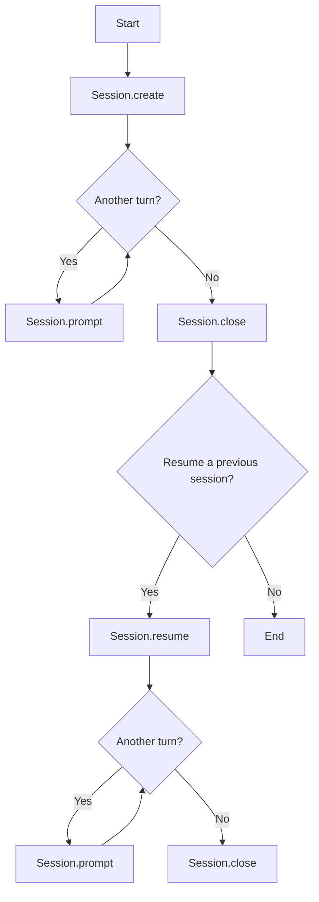

# Session API

`Session` is the low-level Python API for controlling a Kimi Code runtime. It
exposes the raw Wire stream, lets you handle approvals manually, and keeps
conversation state across multiple prompts.

## Concepts: Session, Turn, Step

The runtime is modeled around three concepts:

- **Session**: A running Kimi Code process plus its configuration, tools, and
  conversation state.
- **Turn**: One call to `Session.prompt(...)`. A turn is a full round-trip from
  user input to streamed responses.
- **Step**: A turn can contain multiple steps as the agent reasons, calls tools,
  and produces output. Step boundaries appear as `StepBegin` and
  `StepInterrupted` events in the Wire stream.

Because the API is streaming and stateful, you must consume a turn (or cancel
it) before starting another, and you must resolve every approval request.

## Lifecycle Overview

Create (or resume) a session, issue prompts, then close:




## When to Use Session

Use `Session` when you need control over conversation state or lower-level
access:

- You can run multiple prompts within the same session.
- You can resume previous sessions with `Session.resume(...)`.
- It exposes raw [Wire](https://moonshotai.github.io/kimi-cli/en/customization/wire-mode.html#wire-mode) messages and approvals for fine-grained control.
If you only want assistant text, prefer the high-level `prompt()` helper.

## Quick Example: Streaming UI with Usage and Approvals

This example shows a typical use case: stream text, surface token usage, and
explicitly approve actions.

```python
import asyncio
from kaos.path import KaosPath
from kimi_agent_sdk import ApprovalRequest, Session, StatusUpdate, TextPart


async def main() -> None:
    async with await Session.create(work_dir=KaosPath.cwd()) as session:
        async for msg in session.prompt("Summarize this folder"):
            match msg:
                case TextPart(text=text):
                    print(text, end="", flush=True)
                case StatusUpdate() as status:
                    usage = status.token_usage
                    if usage:
                        print(f"\n[usage] in={usage.input_other} out={usage.output}")
                case ApprovalRequest() as req:
                    print(f"\n[approve] {req.action}: {req.description}")
                    req.resolve("approve")


asyncio.run(main())
```

## API Reference

### `Session.create`

```python
@staticmethod
async def create(
    work_dir: KaosPath | None = None,
    *,
    session_id: str | None = None,
    config: Config | Path | None = None,
    model: str | None = None,
    thinking: bool = False,
    yolo: bool = False,
    agent_file: Path | None = None,
    mcp_configs: list[MCPConfig] | list[dict[str, Any]] | None = None,
    skills_dir: KaosPath | None = None,
    max_steps_per_turn: int | None = None,
    max_retries_per_step: int | None = None,
    max_ralph_iterations: int | None = None,
) -> Session
```

Creates a new Kimi Code session.

Parameters:

- `work_dir`: Working directory for the session (KaosPath). Defaults to
  `KaosPath.cwd()`.
- `session_id`: Optional custom session ID.
- `config`: `Config` instance or path to a config file.
- `model`: Model name, for example `"kimi-k2-thinking-turbo"`.
- `thinking`: Enable thinking mode for supported models.
- `yolo`: Auto-approve all approval requests. When enabled, you may not receive
  `ApprovalRequest` messages.
- `agent_file`: Agent specification file path,  for more details see
  [Custom Agent Files](https://moonshotai.github.io/kimi-cli/en/customization/agents.html#custom-agent-files).
- `mcp_configs`: MCP server configs (same schema as Kimi Code).
- `skills_dir`: Skills directory (KaosPath).
- `max_steps_per_turn`: Maximum number of steps allowed per turn.
- `max_retries_per_step`: Retry limit per step.
- `max_ralph_iterations`: Extra iterations for Ralph mode (`-1` for unlimited).

### `Session.resume`

```python
@staticmethod
async def resume(
    work_dir: KaosPath,
    session_id: str | None = None,
    *,
    config: Config | Path | None = None,
    model: str | None = None,
    thinking: bool = False,
    yolo: bool = False,
    agent_file: Path | None = None,
    mcp_configs: list[MCPConfig] | list[dict[str, Any]] | None = None,
    skills_dir: KaosPath | None = None,
    max_steps_per_turn: int | None = None,
    max_retries_per_step: int | None = None,
    max_ralph_iterations: int | None = None,
) -> Session | None
```

Resumes an existing session in `work_dir`. If `session_id` is omitted, the most
recent session is resumed. Returns `None` if no session is found. Parameters are
the same as `Session.create`, except `work_dir` is required.

### `Session.prompt`

```python
async def prompt(
    user_input: str | list[ContentPart],
    *,
    merge_wire_messages: bool = False,
) -> AsyncGenerator[WireMessage, None]
```

Streams raw `WireMessage` events and requests.

- `user_input`: Plain text, a slash command, or a list of content parts.
- `merge_wire_messages`: When `True`, the Wire layer merges adjacent messages
  where possible (for example, consecutive content parts). This reduces
  fragmentation but can hide some boundaries.

Common message types you may handle:

- **Control**: `TurnBegin`, `StepBegin`, `StepInterrupted`, `CompactionBegin`,
  `CompactionEnd`
- **Content**: `TextPart`, `ThinkPart`, `ImageURLPart`, `AudioURLPart`,
  `VideoURLPart`
- **Tooling**: `ToolCall`, `ToolCallPart`, `ToolResult`
- **Status**: `StatusUpdate` (context usage, token usage)
- **Approvals**: `ApprovalRequest`, `ApprovalRequestResolved`

Any `ApprovalRequest` must be resolved or the turn will block. For a full list
of Wire message types, see the [Kimi Code Wire Mode docs](https://moonshotai.github.io/kimi-cli/en/customization/wire-mode.html#wire-message-types).

### `Session.cancel`

```python
def cancel(self) -> None
```

Signals the active turn to stop. The prompt stream raises `RunCancelled`.

### `Session.close`

```python
async def close(self) -> None
```

Closes the underlying Kimi Code process and cleans up tool resources. Prefer
the async context manager (`async with`) to guarantee cleanup.

### Properties

- `Session.id`: Session ID.
- `Session.model_name`: Active model name.
- `Session.status`: Status snapshot (context usage, yolo state, etc.).

## Approval Requests

`ApprovalRequest` comes from Kimi Code and includes:

- `id`: Unique request identifier.
- `tool_call_id`: Associated tool call ID.
- `sender`: Originating tool or component.
- `action`: Action type (for example, running a command).
- `description`: Human-readable description.
- `display`: Optional rich display blocks for UI rendering.

Resolve with one of:

- `"approve"`
- `"approve_for_session"`
- `"reject"`

`"approve_for_session"` auto-approves subsequent similar requests for the
remainder of the session.

```python
from kimi_agent_sdk import ApprovalRequest


def handle(req: ApprovalRequest) -> None:
    if req.action == "run shell command":
        req.resolve("approve")
    else:
        req.resolve("reject")
```

After resolving a request, the stream may emit `ApprovalRequestResolved` to
confirm the outcome.

## Notes

- **Single active turn**: You cannot run concurrent prompts on one session.
  Starting a new prompt while one is running raises `SessionStateError`.
- **Consume or cancel**: Always consume the prompt stream or call `cancel()`
  before starting a new turn.
- **Approval is mandatory**: An unresolved `ApprovalRequest` blocks the turn.
- **Close is safe**: `close()` cancels any in-flight prompt and cleans up tools.
- **Type enforcement**: `work_dir` and `skills_dir` must be `KaosPath`.
- **Status snapshot**: `Session.status` exposes `context_usage` and
  `yolo_enabled`.

## Errors and Exceptions

Common exceptions raised by the session API:

- `SessionStateError`: Session is closed or already running.
- `TypeError`: Invalid path types for `work_dir` or `skills_dir`.
- `RunCancelled`: The active turn was cancelled.
- `LLMNotSet`, `LLMNotSupported`, `ChatProviderError`: Model or provider issues.
- `MaxStepsReached`: Turn exceeded `max_steps_per_turn`.
- `ConfigError`, `AgentSpecError`, `InvalidToolError`, `MCPConfigError`,
  `MCPRuntimeError`: Invalid configuration or tool setup.

## Examples

### Multi-Turn Conversation

```python
import asyncio
from kaos.path import KaosPath
from kimi_agent_sdk import ApprovalRequest, Session, TextPart


async def run_turn(session: Session, text: str) -> None:
    async for msg in session.prompt(text):
        match msg:
            case TextPart(text=text_out):
                print(text_out, end="", flush=True)
            case ApprovalRequest() as req:
                req.resolve("approve")
    print()


async def main() -> None:
    async with await Session.create(work_dir=KaosPath.cwd()) as session:
        await run_turn(session, "What is 2 + 2?")
        await run_turn(session, "Now multiply that by 10")


asyncio.run(main())
```

### Resuming a Session Later

```python
import asyncio
from kaos.path import KaosPath
from kimi_agent_sdk import ApprovalRequest, Session, TextPart


async def main() -> None:
    work_dir = KaosPath.cwd()
    session = await Session.resume(work_dir)
    if session is None:
        session = await Session.create(work_dir=work_dir)

    async with session:
        async for msg in session.prompt("Continue from last time"):
            match msg:
                case TextPart(text=text):
                    print(text, end="", flush=True)
                case ApprovalRequest() as req:
                    req.resolve("approve")


asyncio.run(main())
```

### Cancelling a Turn

```python
import asyncio
from kaos.path import KaosPath
from kimi_agent_sdk import RunCancelled, Session, TextPart


async def main() -> None:
    async with await Session.create(work_dir=KaosPath.cwd()) as session:
        async def consume() -> None:
            async for msg in session.prompt("Tell me a long story"):
                match msg:
                    case TextPart(text=text):
                        print(text, end="", flush=True)

        task = asyncio.create_task(consume())
        await asyncio.sleep(2)
        session.cancel()
        try:
            await task
        except RunCancelled:
            print("Cancelled")


asyncio.run(main())
```
